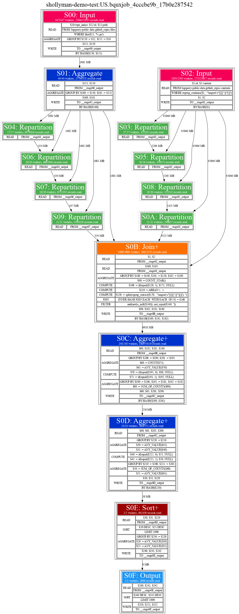

# Query Plan Visualizations


# querygraph CLI

querygraph is a simple CLI tool that can be used to generate visual query graphs from BigQuery query
execution metadata.  

```
Usage: querygraph <job>

Allowed format of the <job> argument:
 - project:location.jobid
 - project:jobid


Optional Flags:

  -dot_path string
        path to the dot (graphviz) binary (default "/usr/bin/dot")
  -out string
        path to the output file.  By default, creates a file based on the job ID in the current directory.
```

The format of the job ID is the same fully qualified format as reported by tools such as the Google Cloud Console or the `bq` CLI tool:  `projectid:location.job_id` or `projectid.job_id`

For example, here's a job with location included:
`shollyman-demo-test:US.bquxjob_4cccbe9b_17b0e287542`

Or, location omitted:
`shollyman-demo-test:bquxjob_4cccbe9b_17b0e287542`

## Dependencies

This tool requires the [graphviz](https://graphviz.org/) `dot` binary to be present on the system where the CLI is run.  The `-dot_path` flag can be used to indicate an alternative location for the binary.

## Examples of Use

### Golang Imports
This query identifies commonly imported golang packages found in the github public data tables.
```sql
SELECT
  entry,
  COUNT(*) as frequency,
  COUNT(DISTINCT repo_name) as distinct_repos
FROM (
  SELECT
    files.repo_name,
    SPLIT(REGEXP_EXTRACT(contents.content, r'.*import\s*[(]([^)]*)[)]'), '\n') AS entries
  FROM `bigquery-public-data.github_repos.contents` AS contents
  JOIN (
    SELECT id, repo_name FROM `bigquery-public-data.github_repos.files`
    WHERE path LIKE '%.go' GROUP BY id, repo_name
  ) AS files
  USING (id)
  WHERE REGEXP_CONTAINS(contents.content, r'.*import\s*[(][^)]*[)]')
)
CROSS JOIN UNNEST(entries) as entry
WHERE entry IS NOT NULL AND entry != ""
GROUP BY entry
ORDER BY distinct_repos DESC, frequency DESC
LIMIT 1000
```




### Top 200 Stackoverflow question tags in the last year

This query examines stackoverflow question data from the trailing 365 days to
identify most frequently used tags, as well as computing some basic tag statistics.
```
SELECT
  tag,
  COUNT(1) as total_questions,
  APPROX_COUNT_DISTINCT(owner_user_id) as approx_questioners,
  FORMAT("%.2f", AVG(score)) as avg_score,
  MAX(score) as max_score,
FROM
(
SELECT
  tag,
  id as question_id,
  owner_user_id,
  score,
FROM `bigquery-public-data.stackoverflow.posts_questions` t,
UNNEST(SPLIT(t.tags,"|")) as tag
WHERE creation_date > TIMESTAMP_SUB(CURRENT_TIMESTAMP(), INTERVAL 365 DAY)
)
GROUP BY tag
ORDER BY total_questions DESC 
LIMIT 200
```

